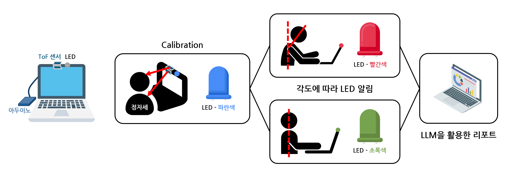

# 🧍‍♂️ 거북목 방지 모니터  
### “당신의 하루 자세를 데이터로 기록합니다.”

  

> 📱 모바일에서 바로 접속하려면 QR 코드를 스캔하세요.
> 하루 동안의 측정 데이터를 기반으로 자동 생성된 리포트입니다.  
> 자세 변화, 숙임 비율, 구간별 행동 분석, 그리고 코치 피드백이 함께 제공됩니다.

  
  
  

## 👋 소개

**거북목 방지 모니터**는 ToF 센서를 이용해 사용자의 **목 기울기(θ_neck)** 를 실시간으로 감지하고,  
AI 분석을 통해 **자세 습관을 교정**해주는 개인용 자세 모니터링 서비스입니다.  

정자세를 인식하고, 숙임을 감지하며,  
당신의 하루를 데이터로 기록해줍니다.  

## 🌿 서비스 가치

* 일상 속 자세를 **데이터로 시각화**
* 하루 동안의 **숙임 패턴을 분석**
* 스스로 자세를 인식하고 **습관을 교정**

> “앉아 있는 시간이 길수록, 자세를 바로 세워야 할 이유가 커집니다.”

## 💡 주요 기능

- 🧭 **정자세 보정 (5초 자동 캘리브레이션)**  
- 📡 **실시간 목 기울기 감지**  
- 💾 **CSV 자동 저장 및 1분 단위 분석**  
- 📊 **거북목 비율 데이터(JSON)**  
- 💬 **AI 피드백 리포트 생성**  

## ⚙️ 시스템 구성

  

## 🚀 사용 방법

### 1️⃣ 아두이노 설정

1. `arduino/posture_monitor.ino` 업로드
2. 센서 연결 후, 5초간 정자세 유지
3. 시리얼 모니터에서 `Calibration complete!` 확인

### 2️⃣ 데이터 수집

1. 개발 도구

2.
- `data_csv/` 실시간 각도 저장 (time : theta_neck)
- `data_json/` 1 분 단위 정제 → 거북목 비율 (%)
- `data_json/` 하루 JSON 저장
- `python/app.py` LLM 분석 
